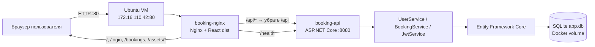
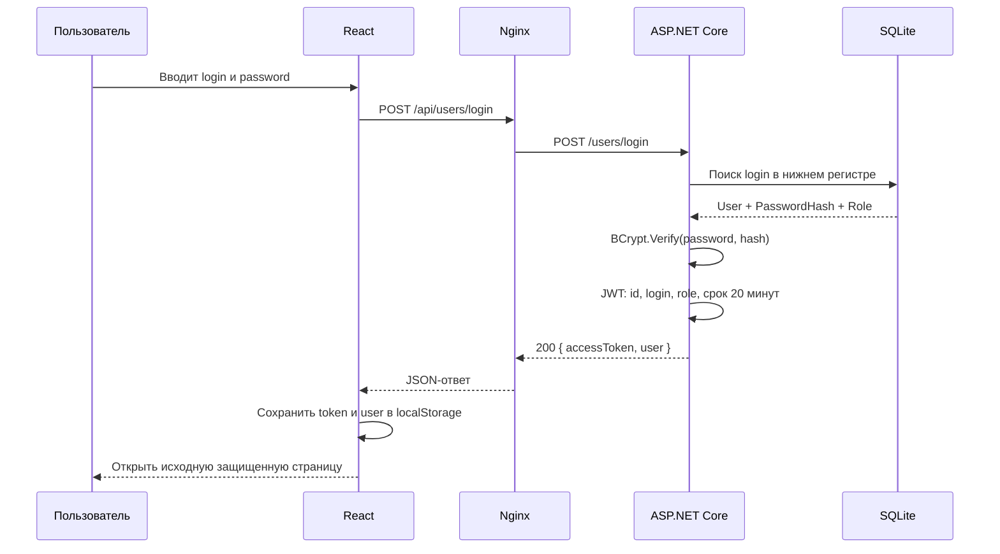
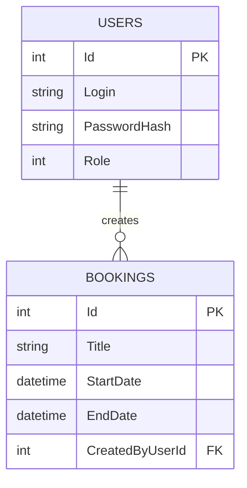

# BookingApi: архитектура, работа приложения и эксплуатация

## 1. Назначение документа

Этот документ описывает фактически развернутую 22 июля 2026 года конфигурацию BookingApi: браузерный интерфейс, HTTP API, авторизацию, бизнес-логику, базу SQLite, Docker-контейнеры, Nginx и основные операции обслуживания.

Документ намеренно не содержит паролей, JWT-ключа и других секретов. Они хранятся только в серверном файле `.env`, который не входит в Docker-образы и не должен попадать в Git.

## 2. Текущее состояние развертывания

| Параметр | Значение |
|---|---|
| Сервер | Ubuntu Server 24.04.4 LTS |
| Адрес приложения | `http://172.16.110.42/` |
| Публичный health check | `http://172.16.110.42/health` |
| Health check через префикс API | `http://172.16.110.42/api/health` |
| Каталог на сервере | `/home/dev/apps/booking-api` |
| Оркестрация | Docker Compose |
| Контейнер API | `booking-api`, статус `healthy` |
| Контейнер фронтенда и прокси | `booking-nginx`, статус `healthy` |
| Хранилище | именованный Docker volume `booking-api_booking_data` |
| Открытые UFW-порты | `22/tcp` для SSH и `80/tcp` для HTTP |

Адрес `172.16.110.42` относится к частной сети. Приложение будет открываться только с устройств, у которых есть маршрут в эту сеть, например из той же локальной сети или через VPN.

Соединение пока работает по обычному HTTP. Логин, пароль и JWT-токен передаются без TLS-шифрования, поэтому такую конфигурацию допустимо использовать только в доверенной закрытой сети. Для публичного доступа сначала нужны доменное имя и HTTPS.

## 3. Общая схема



Главная идея архитектуры — один внешний адрес для всего приложения:

1. Браузер всегда обращается к `http://172.16.110.42`.
2. Nginx отдает собранные HTML, CSS и JavaScript-файлы React.
3. Запросы с префиксом `/api/` Nginx перенаправляет в контейнер ASP.NET Core.
4. Сам API не опубликован на сетевом интерфейсе виртуальной машины. Порт `8080` доступен только контейнеру Nginx через внутреннюю Docker-сеть.
5. API читает и изменяет SQLite-файл в постоянном Docker volume. Пересоздание контейнера не удаляет данные.

## 4. Компоненты и зависимости

### 4.1. Фронтенд

| Зависимость | Роль |
|---|---|
| React 19 | Компоненты интерфейса и состояние приложения |
| React DOM 19 | Отрисовка React-приложения в браузере |
| React Router 8 | Клиентские маршруты, перенаправления и защита страниц |
| TypeScript 6 | Проверка типов до сборки |
| Vite 8 | Сборка исходников в оптимизированные статические файлы |
| ESLint 10 | Статическая проверка кода |
| Nginx Alpine | Отдача статики, SPA fallback и reverse proxy к API |

React, React Router и прикладной код входят в JavaScript-бандл, который выполняется в браузере. TypeScript, Vite и ESLint нужны только во время разработки и сборки; в итоговом контейнере Node.js отсутствует.

### 4.2. Бэкенд

| Зависимость | Роль |
|---|---|
| ASP.NET Core / .NET 10 | HTTP-сервер и Minimal API |
| Entity Framework Core 10 | Доступ к данным, LINQ-запросы и миграции схемы |
| EF Core SQLite | Провайдер EF Core для SQLite |
| SQLitePCLRaw | Нативная библиотека SQLite внутри Linux-контейнера |
| JwtBearer | Проверка подписи, срока, issuer и audience JWT |
| System.IdentityModel.Tokens.Jwt | Создание JWT-токена при входе |
| BCrypt.Net-Next | Хеширование и проверка паролей |
| Swashbuckle / OpenAPI | Swagger в режиме Development |
| curl | Внутренний health check контейнера API |

Прямо закрепленные версии `Microsoft.OpenApi` и `SQLitePCLRaw.bundle_e_sqlite3` нужны, чтобы сборка не выбирала уязвимые транзитивные версии. На момент развертывания проверка NuGet-пакетов и `npm audit` не нашла известных уязвимостей.

### 4.3. Инфраструктура

| Компонент | Роль |
|---|---|
| Docker Engine | Изоляция приложения и воспроизводимый запуск |
| Docker Compose | Описание API, Nginx, сети, volume, health checks и перезапуска |
| Docker network | Внутренний DNS и связь `booking-nginx → booking-api` |
| Docker volume | Постоянное хранение `/app/data/app.db` |
| UFW | Разрешает только SSH и HTTP |

## 5. Каталоги и важные файлы

Развертываемая копия на рабочем компьютере находится отдельно от исходных проектов:

```text
deployment/booking-api/
├── compose.yaml              # оба сервиса, сеть и постоянный volume
├── Dockerfile                # сборка и runtime бэкенда
├── .dockerignore             # исключение секретов, БД и лишних файлов
├── BookingApi.csproj         # .NET и NuGet-зависимости
├── Program.cs                # DI, JWT, EF Core и HTTP pipeline
├── Data/                     # DbContext и начальное создание администратора
├── Domain/                   # модели User и Booking
├── Dto/                      # входные и выходные контракты API
├── Endpoints/                # маршруты /users и /bookings
├── Services/                 # бизнес-логика и JWT
├── Migrations/               # история изменений схемы SQLite
├── frontend/
│   ├── Dockerfile            # Node build → Nginx runtime
│   ├── nginx.conf            # статика, SPA fallback, /api proxy
│   ├── package.json          # npm-зависимости и команды
│   └── src/                  # React/TypeScript-код
└── ARCHITECTURE.md           # этот документ
```

На виртуальной машине структура размещена в `/home/dev/apps/booking-api`. Файл `/home/dev/apps/booking-api/.env` существует только на сервере и имеет права `600`: читать и менять его может владелец `dev`, но не остальные обычные пользователи.

Исходные каталоги разработчика не изменялись:

- бэкенд: `/Users/ruslan/RiderProjects/BookingApi/BookingApi`;
- фронтенд: `/Users/ruslan/RiderProjects/BookingApi/BookingApi.Frontend`.

## 6. Как маршрутизируются запросы

| Запрос браузера | Действие Nginx | Результат |
|---|---|---|
| `/` | SPA fallback | Возвращается `index.html`, React переводит на `/bookings` |
| `/login` | SPA fallback | Возвращается `index.html`, React показывает LoginPage |
| `/bookings` | SPA fallback | Работает и при прямом открытии/обновлении страницы |
| `/bookings/123/edit` | SPA fallback | React читает `123` как параметр маршрута |
| `/assets/...` | Отдача реального файла | JS/CSS кешируются браузером на год |
| `/api/users/login` | Proxy на `http://booking-api:8080/users/login` | Префикс `/api` удаляется |
| `/api/bookings?page=1&pageSize=10` | Proxy на `http://booking-api:8080/bookings?...` | API возвращает JSON |
| `/api/health` | Proxy на `http://booking-api:8080/health` | Проверка API через общий префикс |
| `/health` | Отдельный точный proxy | Совместимый внешний health check |

Слэш в конце `proxy_pass http://booking-api:8080/;` существенен: именно он заменяет совпавший префикс `/api/` на `/`. Поэтому фронтенд вызывает `/api/bookings`, хотя ASP.NET Core регистрирует маршрут `/bookings`.

`try_files $uri $uri/ /index.html` нужен для BrowserRouter. Без него обновление страницы `/bookings` заставило бы Nginx искать физический файл `bookings` и вернуть 404.

## 7. Запуск фронтенда в браузере

Последовательность первого открытия выглядит так:

1. Браузер запрашивает `/` у Nginx.
2. Nginx возвращает `/usr/share/nginx/html/index.html`.
3. Браузер загружает хешированные JS/CSS-файлы из `/assets/`.
4. `main.tsx` монтирует React-приложение.
5. `AuthProvider` читает JWT и пользователя из `localStorage`.
6. Если токена или объекта пользователя нет, поврежденное/неполное состояние очищается.
7. React Router переводит `/` на `/bookings`.
8. `ProtectedRoute` отправляет неавторизованного пользователя на `/login` и запоминает исходный адрес для возврата после входа.
9. После входа страница бронирований отправляет запрос в API с заголовком `Authorization: Bearer <token>`.

Ключи браузерного хранилища:

- `bookingApi.auth.token` — JWT;
- `bookingApi.auth.user` — сериализованные id, login и роль пользователя.

Фронтенд определяет факт входа по наличию обоих значений. Он пока не декодирует JWT и не проверяет срок его действия заранее. Через 20 минут API перестанет принимать истекший токен, но интерфейс сам автоматически не выполнит logout. Это один из пунктов для дальнейшего улучшения.

## 8. Полный сценарий входа



Подробно:

1. `LoginPage` передает введенные значения в `AuthProvider.login`.
2. `authApi.login` вызывает общий `apiClient` с путем `/users/login`.
3. При production-сборке `VITE_API_BASE_URL=/api`, поэтому фактический URL равен `/api/users/login`.
4. Nginx удаляет `/api` и передает JSON в ASP.NET Core.
5. `UserService.LoginAsync` обрезает пробелы у логина и приводит его к нижнему регистру.
6. Пользователь ищется в таблице `Users`.
7. Полученный из запроса пароль не сравнивается и не хранится открытым текстом: BCrypt проверяет его относительно `PasswordHash`.
8. `JwtService` создает claims: идентификатор пользователя, логин и роль.
9. Токен подписывается симметричным ключом алгоритмом HMAC SHA-256 и действует 20 минут.
10. Клиент проверяет, что в ответе есть непустой `accessToken` и объект `user`, затем сохраняет их.
11. Каждый защищенный API-запрос получает Bearer-заголовок.
12. JwtBearer на сервере проверяет подпись, срок, issuer и audience до вызова endpoint.

Роль в базе хранится как число, потому что `Roles` — enum:

| Число | Роль | Возможности |
|---:|---|---|
| 0 | Admin | Все операции с пользователями и бронированиями |
| 1 | Moderator | Чтение; создание; изменение и удаление только своих бронирований |
| 2 | Viewer | Только чтение доступных списков и отдельных бронирований |

Фронтенд преобразует числовую роль из ответа API в строки `Admin`, `Moderator`, `Viewer`. Сервер при этом принимает решения самостоятельно по role claim JWT; скрытие кнопки во фронтенде не является механизмом безопасности.

## 9. React-маршруты и защита страниц

| Маршрут | Компонент | Доступ |
|---|---|---|
| `/` | перенаправление | На `/bookings` |
| `/login` | `LoginPage` | Всем |
| `/bookings` | `BookingsPage` | Любой вошедший пользователь |
| `/my-bookings` | `MyBookingsPage` | Любой вошедший пользователь |
| `/bookings/create` | `CreateBookingPage` | Admin или Moderator |
| `/bookings/:id/edit` | `EditBookingPage` | Admin или Moderator |
| любой неизвестный путь | `NotFoundPage` | Всем |

`ProtectedRoute` выполняет два разных действия:

- без действующей локальной сессии перенаправляет на `/login`;
- при наличии сессии, но неподходящей роли перенаправляет на `/bookings`.

`RoleGuard` используется для условного отображения элементов интерфейса. Он улучшает удобство, но API все равно повторно проверяет роль и владельца записи.

## 10. HTTP API и права доступа

Nginx добавляет внешний префикс `/api`; в таблице одновременно показаны оба вида пути.

| Внешний путь | Путь ASP.NET Core | Метод | Доступ | Назначение |
|---|---|---:|---|---|
| `/api/users/login` | `/users/login` | POST | без JWT | Проверить пароль и выдать JWT |
| `/api/users/` | `/users/` | GET | Admin | Список пользователей |
| `/api/users/{id}` | `/users/{id}` | GET | Admin | Один пользователь |
| `/api/users/` | `/users/` | POST | Admin | Создать пользователя |
| `/api/bookings/` | `/bookings/` | GET | любая роль | Страница общего списка |
| `/api/bookings/my` | `/bookings/my` | GET | любая роль | Бронирования текущего пользователя |
| `/api/bookings/{id}` | `/bookings/{id}` | GET | любая роль | Одно бронирование |
| `/api/bookings/` | `/bookings/` | POST | Admin, Moderator | Создать бронирование |
| `/api/bookings/{id}` | `/bookings/{id}` | PUT | Admin, Moderator | Обновить бронирование с проверкой владельца |
| `/api/bookings/{id}` | `/bookings/{id}` | DELETE | Admin, Moderator | Удалить бронирование с проверкой владельца |
| `/api/health` или `/health` | `/health` | GET | без JWT | Состояние API |

Основные HTTP-ответы:

- `200 OK` — чтение или успешный login;
- `201 Created` — создан пользователь или бронирование;
- `204 No Content` — успешное изменение или удаление;
- `400 Bad Request` — ошибка валидации;
- `401 Unauthorized` — JWT отсутствует, поврежден или истек;
- `403 Forbidden` — роль или принадлежность записи не разрешает действие;
- `404 Not Found` — объект или пользователь не найден;
- `409 Conflict` — логин уже занят или время бронирования пересекается;
- `500 Internal Server Error` — необработанная ошибка, клиент получает общий JSON без внутренних деталей.

Большинство ожидаемых ответов `400/404/409` сейчас не содержат подробного JSON-текста, поэтому фронтенд показывает общий текст вида `HTTP error 409`. Структурированные пользовательские сообщения об ошибках — полезное следующее улучшение.

## 11. Бизнес-логика бронирований

### 11.1. Валидация

Создание и обновление разрешены, только если:

- заголовок не пуст и состоит не только из пробелов;
- дата начала не меньше текущего UTC-времени сервера;
- дата окончания строго позже даты начала.

### 11.2. Запрет пересечений

Интервалы конфликтуют при условии:

```text
existing.StartDate < requested.EndDate
AND requested.StartDate < existing.EndDate
```

Это разрешает соседние интервалы, например `10:00–11:00` и `11:00–12:00`, но запрещает любое реальное перекрытие. При обновлении текущая запись исключается из поиска конфликта по `Id`.

### 11.3. Владение

При создании API берет идентификатор автора из JWT, а не из тела запроса. Поэтому клиент не может назначить чужого автора.

- Admin может обновлять и удалять любое бронирование.
- Moderator может обновлять и удалять только запись, у которой `CreatedByUserId` равен его id из JWT.
- Viewer не проходит role policy для POST, PUT и DELETE.

### 11.4. Пагинация

Общий список принимает:

- `page` — номер страницы, начиная с 1;
- `pageSize` — количество элементов от 1 до 100.

Сначала API считает `TotalCount`, затем сортирует по `StartDate`, пропускает элементы предыдущих страниц и берет нужное количество. Ответ содержит `items`, `page`, `pageSize` и `totalCount`.

## 12. Модель данных



`User.Bookings` и `Booking.CreatedByUser` образуют отношение один-ко-многим. Внешний ключ — `Bookings.CreatedByUserId`.

Удаление пользователя с существующими бронированиями ограничено правилом `DeleteBehavior.Restrict`. В текущем API endpoint удаления пользователя вообще не опубликован, но правило также защищает целостность на уровне EF Core/БД.

Логин нормализуется перед созданием и входом: пробелы по краям удаляются, регистр переводится в нижний. Пароль нового пользователя должен иметь не менее 8 символов и сохраняется только как BCrypt-хеш.

## 13. Запуск API и миграции

При старте `booking-api` выполняется следующая цепочка:

1. Создается `WebApplicationBuilder` и загружается конфигурация из переменных окружения.
2. Регистрируется OpenAPI/Swagger.
3. Регистрируются authentication и authorization.
4. JwtBearer получает issuer, audience и секретный ключ.
5. `AppDbContext` настраивается на SQLite connection string.
6. Добавляется CORS-политика для локального Vite-сервера `http://localhost:5173`.
7. В dependency injection регистрируются scoped-сервисы `BookingService`, `UserService` и `JwtService`.
8. Создается приложение и отдельный DI scope для базы.
9. `Database.MigrateAsync()` последовательно применяет отсутствующие миграции.
10. `DbSeeder` проверяет наличие пользователя `admin`; при отсутствии создает его из серверной конфигурации.
11. Swagger UI подключается только в окружении `Development`. На сервере используется `Production`, поэтому Swagger не опубликован.
12. Подключаются authentication и authorization middleware.
13. Регистрируются booking/user endpoints и `/health`.
14. Kestrel начинает слушать контейнерный порт `8080`.

Автоматические миграции удобны для одного экземпляра приложения. Если в будущем появятся несколько экземпляров API, миграции нужно вынести в отдельный контролируемый deployment job, чтобы контейнеры не пытались менять схему одновременно.

## 14. Dependency Injection и время жизни объектов

Все прикладные сервисы имеют время жизни `Scoped`: для каждого HTTP-запроса создается отдельный экземпляр сервиса и `AppDbContext`.

```text
HTTP endpoint
  ├── IBookingService → BookingService
  │     ├── AppDbContext
  │     └── ILogger<BookingService>
  ├── IUserService → UserService
  │     ├── AppDbContext
  │     └── ILogger<UserService>
  └── IJwtService → JwtService
        └── IConfiguration
```

Endpoint отвечает за HTTP-часть: получение route/query/body/claims и преобразование `Result<T>` в статус. Сервис отвечает за валидацию, разрешения и работу с данными. `AppDbContext` преобразует LINQ в SQL. Такое разделение не дает бизнес-логике зависеть от деталей конкретного HTTP-запроса.

## 15. Конфигурация и секреты

Compose читает следующие имена из серверного `.env`:

| Переменная `.env` | Переменная внутри контейнера | Назначение |
|---|---|---|
| `ASPNETCORE_ENVIRONMENT` | `ASPNETCORE_ENVIRONMENT` | `Production`, отключает Swagger |
| `JWT_ISSUER` | `Jwt__Issuer` | Кто выпустил JWT |
| `JWT_AUDIENCE` | `Jwt__Audience` | Для какого API выпущен JWT |
| `JWT_SECRET_KEY` | `Jwt__SecretKey` | Подпись и проверка HMAC SHA-256 |
| `DB_CONNECTION` | `ConnectionStrings__DefaultConnection` | Путь к SQLite внутри контейнера |
| `ADMIN_LOGIN` | `AdminSettings__Login` | Логин первичного администратора |
| `ADMIN_PASSWORD` | `AdminSettings__Password` | Пароль только для первичного создания администратора |

Двойное подчеркивание в именах .NET-переменных обозначает вложенную секцию. Например, `Jwt__Issuer` становится ключом конфигурации `Jwt:Issuer`.

`ADMIN_PASSWORD` не меняет пароль уже существующего администратора: seeder прекращает работу, если в базе уже найден login `admin`. Для смены действующего пароля нужна отдельная операция в БД или специальный endpoint/CLI, которого пока нет.

Фронтенд получает `VITE_API_BASE_URL=/api` как build argument. Это не runtime-секрет: Vite подставляет значение непосредственно в JavaScript при сборке. Любая переменная с префиксом `VITE_` видна пользователю, поэтому в нее нельзя помещать ключи и пароли.

## 16. Docker Compose: что отвечает за что

### 16.1. Сервис `booking-api`

- `build.context: .` — отправляет Docker-файлы из корня развертываемой копии.
- `dockerfile: Dockerfile` — выбирает многоэтапную сборку .NET.
- `image: booking-api:latest` — локальное имя собранного образа.
- `container_name: booking-api` — одновременно понятное имя и DNS-имя в сети.
- `booking_data:/app/data` — постоянный volume; здесь находится `app.db`.
- `environment` — передает только runtime-конфигурацию из `.env`.
- `restart: unless-stopped` — автоматически запускает контейнер после перезагрузки VM, если его не остановили вручную.
- `healthcheck` — вызывает `http://localhost:8080/health` внутри контейнера.
- `logging` — JSON-логи ограничены тремя файлами по 10 МБ.
- `networks` — подключает контейнер к закрытой `booking_network`.

Параметра `ports` у API нет. Строка `8080/tcp` в `docker compose ps` означает только внутренний exposed-порт, а не открытый порт виртуальной машины.

### 16.2. Сервис `nginx`

- `build.context: ./frontend` — сборочный контекст ограничен фронтендом.
- `VITE_API_BASE_URL: /api` — записывает единый относительный API URL в production-бандл.
- `image: booking-web:latest` — образ со статикой и Nginx.
- `ports: 80:80` — единственная публичная точка входа приложения.
- `depends_on.condition: service_healthy` — Nginx запускается после успешного health check API.
- `healthcheck` — Nginx через `127.0.0.1` проксирует `/health` к API; так одним тестом проверяется и прокси, и бэкенд.
- `restart` и `logging` — те же правила автоматического запуска и ротации логов.

### 16.3. Сеть и volume

Compose создает изолированную bridge-сеть. Docker DNS разрешает имя `booking-api`, поэтому в Nginx не зашит динамический IP контейнера.

Volume имеет полное имя `booking-api_booking_data`: Compose добавил префикс проекта `booking-api` к логическому имени `booking_data`. Не выполняйте `docker compose down -v` без подтвержденной резервной копии: флаг `-v` удалит этот volume вместе с базой.

## 17. Многоэтапная сборка контейнеров

### 17.1. Бэкенд

Dockerfile бэкенда выполняет:

1. `FROM .../dotnet/sdk:10.0 AS build` — полный SDK используется только для сборки.
2. `WORKDIR /src` — все следующие относительные пути считаются от `/src`.
3. Сначала копируется `.csproj`, затем выполняется `dotnet restore`; это дает Docker возможность кешировать NuGet-слой.
4. Затем копируется код и выполняется `dotnet publish -c Release`.
5. Второй этап начинается с меньшего `aspnet:10.0`, в нем нет SDK.
6. Устанавливается `curl`, необходимый health check.
7. Из build-этапа копируется только опубликованное приложение.
8. `ENTRYPOINT` запускает `dotnet BookingApi.dll`.

### 17.2. Фронтенд

Dockerfile фронтенда выполняет:

1. `node:24-alpine AS build` содержит Node.js и npm только на этапе сборки.
2. Сначала копируются `package.json` и lock-файл.
3. `npm ci` устанавливает строго версии из `package-lock.json`; в отличие от обычного `npm install`, он предназначен для воспроизводимой CI/deploy-сборки.
4. Копируется TypeScript/React-код.
5. `VITE_API_BASE_URL` задается равным `/api`.
6. `npm run build` сначала запускает TypeScript build, затем Vite и создает `/app/dist`.
7. Runtime-этап использует `nginx:alpine`.
8. Копируются только конфигурация Nginx и содержимое `dist`.
9. Nginx запускается на переднем плане, чтобы Docker мог управлять процессом.

В итоговом web-контейнере нет исходного TypeScript, `node_modules`, npm и Vite. Это уменьшает размер и поверхность атаки.

## 18. Nginx и HTTP-заголовки

Nginx настроен следующим образом:

- `server_tokens off` скрывает точную версию Nginx из стандартных ответов;
- `gzip on` сжимает текст, CSS, JSON, JavaScript и SVG;
- `X-Content-Type-Options: nosniff` запрещает браузеру угадывать другой MIME-тип;
- `X-Frame-Options: DENY` запрещает встраивать приложение в iframe и снижает риск clickjacking;
- `Referrer-Policy: strict-origin-when-cross-origin` ограничивает передачу полного URL на чужие origin;
- реальные IP и схема передаются API через `X-Real-IP`, `X-Forwarded-For`, `X-Forwarded-Proto`;
- ассеты Vite получают `Cache-Control: public, immutable` и срок один год, что безопасно из-за хеша в имени файла.

HTML не получает годовой immutable-кеш, поэтому после следующего деплоя браузер сможет получить новый `index.html`, который ссылается на новые хешированные ассеты.

## 19. Постоянство данных

Путь подключения внутри API должен указывать на `/app/data/app.db`. Каталог `/app/data` смонтирован из Docker volume, поэтому данные переживают:

- `docker compose restart`;
- пересоздание контейнера;
- пересборку образа;
- перезагрузку Ubuntu.

Данные не переживут удаление volume. Опасные операции: `docker compose down -v`, `docker volume rm booking-api_booking_data` и ручное удаление Docker data root.

SQLite подходит для одного экземпляра небольшого приложения. Она не рассчитана на горизонтальное масштабирование несколькими контейнерами API, которые одновременно работают с общей базой через сетевую файловую систему. Для высокой нагрузки и нескольких VM разумный следующий шаг — PostgreSQL.

## 20. Проверка и управление на сервере

Сначала подключитесь и перейдите в каталог:

```bash
ssh dev@172.16.110.42
cd /home/dev/apps/booking-api
```

- Первая строка открывает защищенную SSH-сессию под пользователем `dev`.
- Вторая делает каталог deployment текущим, чтобы Compose нашел `compose.yaml` и `.env`.

Показать состояние:

```bash
docker compose ps
```

Ожидаемый результат — оба контейнера `Up ... (healthy)`, API без опубликованного порта и Nginx с `0.0.0.0:80->80/tcp`.

Посмотреть последние логи:

```bash
docker compose logs --tail=100 booking-api
docker compose logs --tail=100 nginx
```

- `logs` объединяет стандартный вывод выбранного сервиса;
- `--tail=100` ограничивает результат последними 100 строками;
- первая команда показывает EF Core, ошибки API и HTTP-обработку;
- вторая — запросы и ошибки reverse proxy.

Следить за логами в реальном времени:

```bash
docker compose logs --follow --tail=100
```

`--follow` продолжает ждать новые записи. Завершение просмотра сочетанием `Ctrl+C` не останавливает контейнеры.

Перезапустить сервисы без пересборки:

```bash
docker compose restart
```

Пересобрать и применить новую версию:

```bash
docker compose up -d --build
```

- `up` приводит текущее состояние к описанному в Compose;
- `-d` оставляет контейнеры работать в фоне;
- `--build` пересобирает образы перед запуском;
- Compose пересоздает только те контейнеры, чья конфигурация или образ изменились;
- volume базы остается на месте.

Остановить приложение, сохранив БД:

```bash
docker compose down
```

Команда удалит контейнеры и сеть проекта, но без `-v` сохранит именованный volume.

## 21. Резервная копия SQLite

Самый простой консистентный способ — на короткое время остановить запись в базу, скопировать файл из volume и снова запустить API:

```bash
cd /home/dev/apps/booking-api
docker compose stop booking-api
mkdir -p /home/dev/backups/booking-api
docker run --rm \
  -v booking-api_booking_data:/data:ro \
  -v /home/dev/backups/booking-api:/backup \
  alpine:latest \
  sh -c 'cp /data/app.db "/backup/app-$(date +%Y%m%d-%H%M%S).db"'
docker compose start booking-api
docker compose ps
```

Объяснение:

1. `stop booking-api` закрывает SQLite корректно и исключает изменение файла во время копирования.
2. `mkdir -p` создает каталог резервных копий и не завершается ошибкой, если он уже существует.
3. Временный Alpine-контейнер подключает исходный volume только для чтения через `:ro`.
4. Второй mount делает `/home/dev/backups/booking-api` доступным как `/backup`.
5. `cp` добавляет к имени дату и время, чтобы не перезаписать предыдущий файл.
6. `--rm` удаляет временный контейнер после завершения, но не файл backup.
7. `start` запускает прежний API-контейнер.
8. `ps` подтверждает восстановление обоих health checks; Nginx временно может быть `unhealthy`, пока API остановлен.

Переносите резервные копии за пределы этой VM. Файл на том же виртуальном диске не защищает от потери диска или всей машины.

Восстановление перезаписывает рабочую БД и является разрушительной операцией. Перед ним нужно проверить конкретный файл backup, остановить API и сделать дополнительную копию текущей базы.

## 22. Обновление приложения

Рекомендуемая последовательность для каждой версии:

1. Внести и проверить изменения в исходном проекте.
2. Выполнить backend-тесты и frontend lint/build локально.
3. Скопировать обновленные исходники в отдельную deployment-копию, не копируя `.env`, базы, `bin`, `obj`, `node_modules` и `dist`.
4. Проверить изменения `compose.yaml`, Dockerfile и Nginx.
5. Перед потенциально несовместимой миграцией создать backup.
6. Синхронизировать deployment-копию в `/home/dev/apps/booking-api`, не удаляя серверный `.env`.
7. Выполнить `docker compose up -d --build`.
8. Дождаться статуса `healthy`.
9. Проверить `/`, `/bookings`, `/api/health`, login и хотя бы один авторизованный GET.
10. Просмотреть логи на наличие миграционных или runtime-ошибок.

Отдельный запуск `dotnet` или `npm` на Ubuntu не нужен: обе сборки происходят внутри Docker. На VM достаточно Docker Engine и Compose plugin.

## 23. Health checks и автоматическое восстановление

API health check вызывает собственный `/health`. Он подтверждает, что Kestrel отвечает, но сейчас не выполняет отдельный SQL-запрос. Это liveness-проверка приложения, а не полная диагностика доступности БД.

Nginx health check вызывает свой `/health`, а Nginx проксирует запрос в API. Поэтому статус `booking-nginx: healthy` подтверждает одновременно:

- запуск процесса Nginx;
- работоспособность его proxy-конфигурации;
- Docker DNS и внутреннюю сеть;
- ответ процесса API.

`restart: unless-stopped` перезапускает завершившийся контейнер и поднимает приложение после запуска Docker. Сам по себе Docker не перезапускает работающий, но только `unhealthy` контейнер. Для автоматического перезапуска именно по health status нужен дополнительный механизм наблюдения или внешний оркестратор.

## 24. Безопасность

Реализованные меры:

- наружу опубликован только Nginx; Kestrel закрыт внутри Docker-сети;
- UFW оставляет только SSH и HTTP;
- пароли пользователей хранятся как BCrypt-хеши;
- JWT проверяется по подписи, issuer, audience и сроку;
- серверный `.env` имеет права `600`;
- `.dockerignore` исключает `.env`, `appsettings*.json`, базы и build-артефакты из Docker context;
- Swagger выключен в Production;
- ошибки 500 скрывают stack trace от клиента;
- Nginx добавляет базовые защитные заголовки;
- Docker-логи ограничены по размеру;
- dependency audit на дату деплоя не нашел известных уязвимостей.

Важные следующие шаги:

1. Сменить пароль SSH, который использовался при развертывании и передавался в переписке.
2. Настроить вход по SSH-ключу, проверить его, затем отключить password authentication.
3. Для любого доступа вне доверенной сети добавить домен и HTTPS.
4. Регулярно ставить обновления безопасности Ubuntu и пересобирать образы с актуальными base images.
5. Рассмотреть хранение токена в защищенной HttpOnly/Secure/SameSite cookie. `localStorage` доступен JavaScript и увеличивает последствия XSS.
6. Добавить Content-Security-Policy после проверки нужных источников.
7. Добавить rate limiting на `/users/login` и журналирование неудачных входов.
8. Добавить механизм смены/сброса пароля и ротации JWT secret.
9. Не размещать реальные секреты в исходном `appsettings*.json` или frontend `.env*`.

После смены `JWT_SECRET_KEY` все ранее выданные токены становятся недействительными, что является ожидаемым и полезным эффектом ротации.

## 25. Известные технические ограничения

- Нет HTTPS; трафик не шифруется.
- Один экземпляр API и один SQLite-файл являются single point of failure.
- Нет CI/CD: обновление выполняется вручную.
- Нет refresh token; JWT живет 20 минут.
- Фронтенд не проверяет истечение JWT заранее и не делает автоматический logout после `401`.
- JWT хранится в `localStorage`.
- Health endpoint не проверяет реальный SQL-запрос к базе.
- Ожидаемые API-ошибки часто не содержат понятного JSON-сообщения.
- CORS разрешает только `http://localhost:5173`; production работает благодаря same-origin Nginx и CORS ему не требуется.
- Seeder сначала вычисляет BCrypt-хеш, а уже затем проверяет пароль на пустоту. Текущая серверная конфигурация заполнена, но в коде безопаснее сначала валидировать настройки.
- Seeder всегда ищет literal login `admin`, даже если `AdminSettings:Login` задан иначе. Эти два источника должны быть согласованы либо код нужно исправить.
- В development-конфигурации исходного проекта имя секции администратора должно совпадать с `AdminSettings`, иначе seeder ее не прочитает.
- При нескольких одновременных запросах проверка пересечения и вставка не объединены уникальным ограничением БД; теоретически возможна гонка. Для строгой гарантии нужны транзакция с подходящим уровнем изоляции или отдельная модель блокировок.
- Data Protection keys ASP.NET Core не сохраняются в volume. Для текущего Bearer JWT это не влияет на проверку токенов, но станет важно при переходе на cookie-authentication или использовании функций Data Protection.

## 26. Диагностика типовых проблем

### Страница не открывается

1. Проверить маршрут до `172.16.110.42` и доступность частной сети.
2. Проверить `docker compose ps`.
3. Проверить логи `nginx`.
4. Проверить UFW: порт 80 должен быть разрешен.

### Корневая страница работает, API — нет

1. Открыть `/health` и `/api/health`.
2. Проверить health контейнера API.
3. Посмотреть логи `booking-api` на ошибки миграции, конфигурации JWT или SQLite.
4. Проверить, что оба контейнера подключены к `booking_network`.

### После обновления фронтенда видна старая версия

1. Убедиться, что web-образ был пересобран с `--build`.
2. Проверить время создания контейнера `booking-nginx`.
3. Выполнить жесткое обновление страницы. Хешированные ассеты кешируются надолго, но новый `index.html` должен ссылаться на новые имена.

### Login возвращает 401/404/400

- `404` сейчас может означать, что login не найден;
- `400` — неверный пароль или некорректные входные данные;
- `401` на последующих запросах означает отсутствующий, неверный или истекший JWT;
- проверить, что часы VM синхронизированы, поскольку срок JWT основан на UTC.

### Контейнер API не стартует после изменения конфигурации

Проверить наличие всех переменных в `.env`, не выводя секретные значения в общий лог. Особенно важны JWT secret, connection string и первоначальные admin credentials. Затем посмотреть первые строки `docker compose logs booking-api`.

## 27. Что было проверено после деплоя

22 июля 2026 года выполнены следующие проверки:

- frontend `npm ci`;
- TypeScript/Vite production build с `VITE_API_BASE_URL=/api`;
- ESLint без ошибок;
- `npm audit` без известных уязвимостей после обновления lock-файла;
- NuGet audit с транзитивными зависимостями без известных уязвимостей;
- Docker build обоих образов;
- оба контейнера перешли в `healthy`;
- `/` вернул HTML и корректный заголовок страницы;
- прямое открытие `/bookings` вернуло SPA, а не 404;
- JavaScript asset вернулся с MIME-типом `application/javascript`;
- `/health` и `/api/health` вернули состояние `Healthy`;
- реальный POST login через `/api/users/login` вернул непустой JWT и пользователя;
- API не публикует порт `8080` наружу;
- исходные каталоги бэкенда и фронтенда не изменялись.

Полноценная визуальная проверка частного IP во встроенном браузере была заблокирована корпоративной политикой доступа к приватным сетевым адресам. Поэтому работоспособность подтверждена HTTP-проверками, production-сборкой, API login и health checks контейнеров. Интерфейс желательно дополнительно открыть вручную на компьютере в той же сети и пройти создание/редактирование бронирования под Admin и Moderator.

## 28. Рекомендуемый следующий этап

Для внутреннего стенда текущая схема работоспособна. Для production в порядке приоритета нужны:

1. ротация SSH-пароля и переход на ключи;
2. домен и HTTPS;
3. внешние автоматические резервные копии;
4. автоматическое обновление/CI/CD с проверками до deployment;
5. PostgreSQL при росте нагрузки или необходимости нескольких экземпляров;
6. улучшение lifecycle авторизации и сообщений об ошибках;
7. метрики, внешний uptime monitor и централизованные логи.
